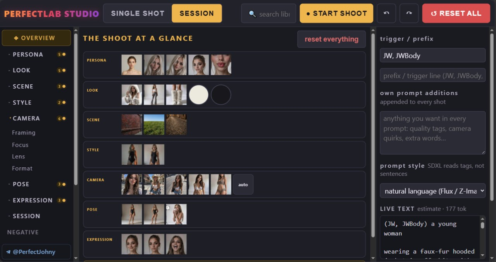

# Hi, I'm Perfect Johny 👋

**Founding Engineer** · building AI-powered SaaS & automation systems end-to-end — from idea to shipped product.

---

## 🧪 Featured project

[**PerfectLab Studio**](https://github.com/perfectmodelslab/ComfyUI-PerfectLab)

One ComfyUI node that builds a whole photoshoot prompt: persona, wardrobe, scene, light, camera — every pick previews with a real photo tile (511 of them). Sessions walk crops, poses and expressions per shot; `{a|b|c}` choices and wildcard files resolve from the seed; a linter badge catches prompt problems before you render.

## 🛠 Stack & focus

`Python` · `JavaScript` · `ComfyUI / Stable Diffusion` · `AI tooling` · `SaaS & automation`

## 📫 Contact

